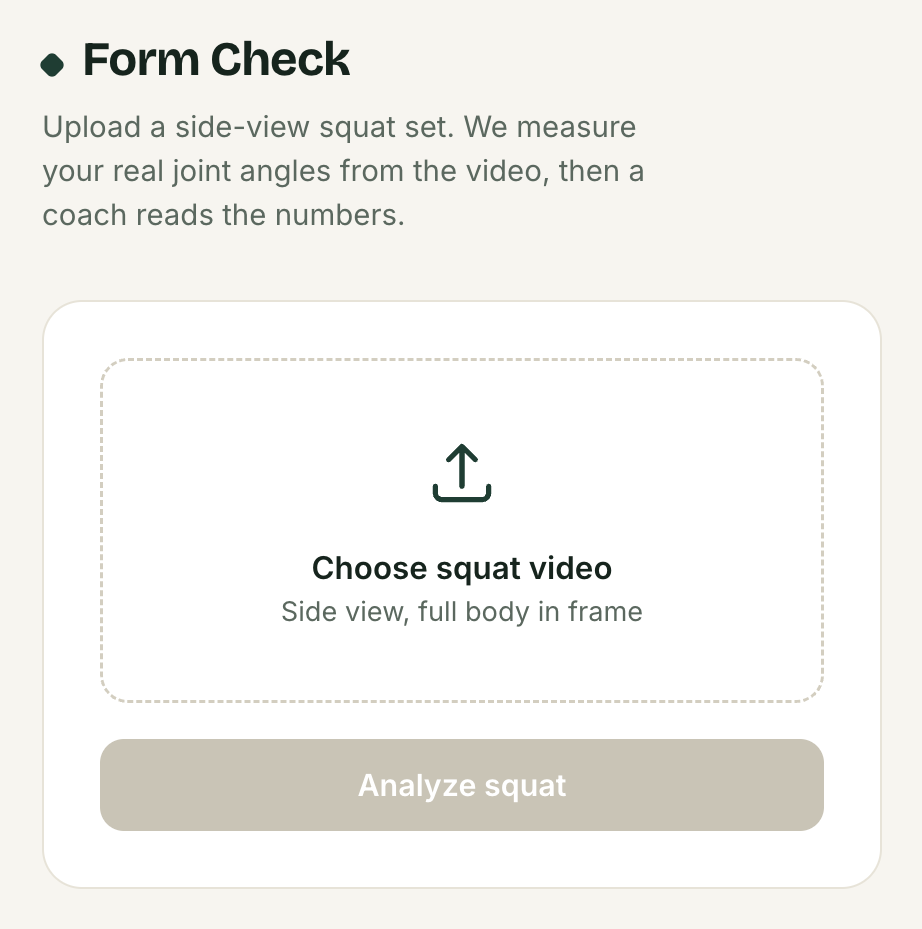
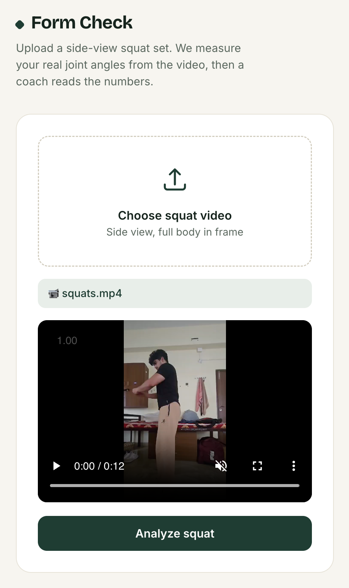
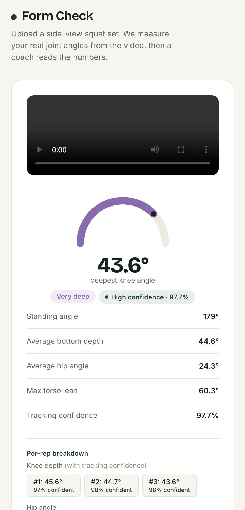
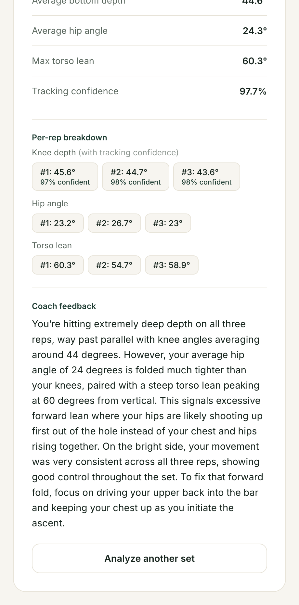

# Form Check Coach

Give it a video of you squatting, it tells you what's actually wrong with your form — not a generic tip, an explanation grounded in the real angles from your video.

I lift, so I'm not building this blind — I know what a squat is actually supposed to look like, which means I can tell the difference between feedback that's genuinely correct and feedback that just sounds plausible. That mattered more than expected: it's easy for an LLM to hand back something that reads like real coaching but is subtly off, and the only way to catch that is to already know the answer before you ask the question.

## What it actually does

You upload a side-view video of a squat set. The app:

1. Runs MediaPipe pose estimation over the video frame by frame to find your joints (shoulder, hip, knee, ankle), filtering by how confident MediaPipe is about each landmark
2. Calculates knee angle, hip angle, and torso lean per frame, and detects individual reps from the knee-angle curve
3. Tracks landmark visibility at each rep to produce a per-rep and overall tracking-confidence score, alongside the angle numbers
4. Generates a skeleton-overlay video so you can see exactly what was measured, not just trust the numbers
5. Sends the verified angles, depth, and confidence scores to Gemini and asks it to explain the form in plain language — including a caveat when tracking confidence was low for that rep
6. Shows you the result: deepest knee angle, standing angle, hip angle, torso lean, tracking confidence, a per-rep breakdown, and the written coach feedback






## Why it's split into two parts

Same pattern as Chess Coach: don't trust the LLM with anything you can calculate yourself.

- **MediaPipe** does all the actual measurement — joint positions, angles, depth. Pure math off real pixels, never guessed.
- **Gemini** only writes the explanation. It gets handed the numbers and the confidence score, it doesn't work anything out itself.

This split exists because of a project that came before it. My earlier Table Tennis Coach attempt just handed video straight to the model and asked it to judge form directly — no measurement step in between. It guessed a lot, and got a lot of those guesses wrong, because there was nothing grounding its answer in what actually happened in the frame. Form Check Coach is built the opposite way on purpose: MediaPipe measures first, Gemini only explains numbers it's already been given.

## The bug that actually mattered

Clicking "Analyze" would trigger a full page reload mid-request — the network log would just vanish, and it looked like the request was silently failing before I could ever see a response. The actual cause: the dev server (VS Code's Live Server) was watching the whole project folder for changes, and once the backend started writing the skeleton-overlay video into a `results/` folder, Live Server saw that as a file change and auto-reloaded the page it was serving — killing the in-flight request every single time. It only started happening once the overlay-video feature was added, since earlier versions never wrote files to disk during analysis. Fixed by excluding `results/**` from Live Server's watched files, so generating output no longer triggers a reload.

## Other stuff that broke

- **Rep detection was frame-rate dependent.** `find_reps()` used a fixed frame-count gap (`min_gap=10`) to avoid double-counting a rep on a small wobble near the bottom. That's fine at one fps, but the same gap means a different real-world time window on a 30fps phone video versus a 60fps one — so the same squat tempo could get miscounted purely because of the source video's frame rate. Fixed by converting it to a time-based gap (`min_gap_seconds=0.5`, converted to frames using the video's actual fps) instead of a hardcoded frame count.
- **Backend hardcoded `127.0.0.1` for the overlay video URL.** Worked fine locally, would've silently pointed at your own laptop once deployed. Fixed by building the URL from the incoming request's actual host (`request.base_url`) instead of hardcoding it, so the same code works unchanged locally and once deployed.

## Did I actually check it works

Before building any of the pipeline, I validated MediaPipe's readings against my own eye on two test videos, filming myself squatting and checking the numbers against what I actually did. The first video caught a real problem: the last rep's angle dropped to an anatomically impossible ~9.5°, and reviewing the skeleton overlay showed exactly why — MediaPipe briefly lost my hip landmark and snapped it up near my stomach for a few frames. A second, more carefully framed video (full body kept in frame the whole time) came back clean: three squats, smooth frame-to-frame transitions, consistent depth (34–38°) across all three reps. That's what led directly to the glitch-filtering logic in the final pipeline — checking my own reps first is what told me the tracking needed a trust layer, not just raw output.

## What this can't do

- Needs a clean side-view, full body in frame — no front-view or angled-camera support
- Squat only for now — no support for other lifts
- Sensitive to occlusion and framing: if a joint drifts out of frame or gets briefly blocked (arms crossing the torso, standing too close to the frame edge), tracking confidence drops for that rep and the reading gets flagged or filtered rather than trusted blindly

## How it's built

- **Backend:** Python, FastAPI, MediaPipe, OpenCV, Gemini API (`google-genai`)
- **Frontend:** plain HTML/CSS/JS, no framework — video preview, upload progress, skeleton overlay playback

## Running it

```
# backend
uvicorn main:app --reload

# then open index.html (e.g. via VS Code's Live Server)
```

You'll need a Gemini API key in a `.env` file:
```
GEMINI_API_KEY=your_key_here
```
